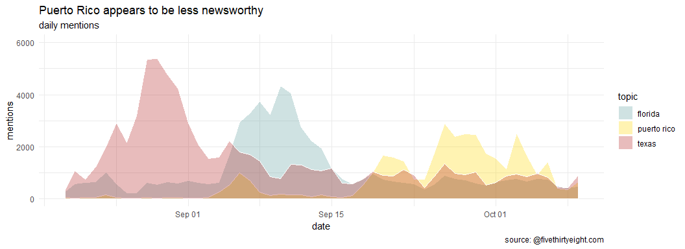
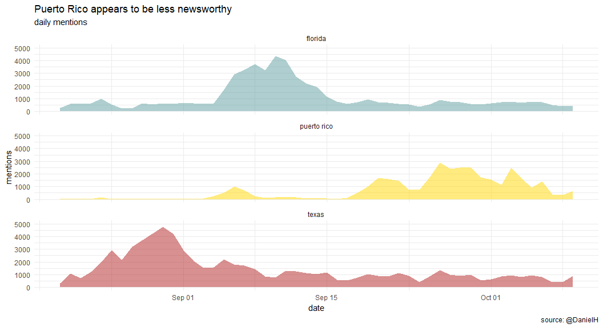
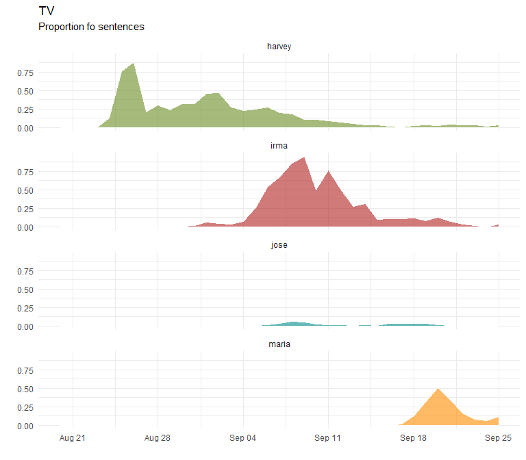

week 12
================
DanielH
June 19, 2018

-   [written media, mediacloud outlets](#written-media-mediacloud-outlets)
-   [plot google trends](#plot-google-trends)
-   [plot states](#plot-states)
-   [tv coverage](#tv-coverage)

``` r
library(tidyverse)
library(modelr)
library(lubridate)
library(ggthemes)
library(ggrepel)
library(purrrlyr)
library(knitr)
library(gridExtra)
library(broom)
library(corrr)


paths <-
  c(written_media = "https://raw.githubusercontent.com/rfordatascience/tidytuesday/master/data/2018-06-19/week12_mediacloud_hurricanes.csv",
    states = "https://raw.githubusercontent.com/rfordatascience/tidytuesday/master/data/2018-06-19/week12_mediacloud_states.csv",
    top_online_news = "https://raw.githubusercontent.com/rfordatascience/tidytuesday/master/data/2018-06-19/week12_mediacloud_top_online_news.csv",
    trump = "https://raw.githubusercontent.com/rfordatascience/tidytuesday/master/data/2018-06-19/week12_mediacloud_trump.csv",
    tv_media = "https://raw.githubusercontent.com/rfordatascience/tidytuesday/master/data/2018-06-19/week12_tv_hurricanes.csv")


# read all files to a list, except for gtrends
p_rico_dat <-
  paths %>%
  map(read_csv)

# read gtrends
gtrends_dat <-
  ("https://raw.githubusercontent.com/rfordatascience/tidytuesday/master/data/2018-06-19/week12_google_trends.csv") %>%
  read_csv(skip = 1) 


# extract written media tibble
written_media <-
  p_rico_dat %>%
  .[[1]]

# extract tv media
tv_media <-
  p_rico_dat %>%
  .[[5]]

# ------------------------ rename cols
colnames(written_media) <-
  c("date", "harvey", "irma", 
  "maria", "jose")


colnames(tv_media) <-
   c("date", "harvey", "irma", 
  "maria", "jose")


# ------------------------------ tv_media
tv_media <-
  tv_media %>%
  mutate(date = str_replace_all(date, "/", "-"),
         date = mdy(date))

written_media <-
  written_media %>%
  mutate(date = str_replace_all(date, "/", "-"),
         date = mdy(date))
```

written media, mediacloud outlets
---------------------------------

``` r
# faceting
written_media %>%
  gather("hurricane", "value", -date) %>%
  mutate(hurricane = as_factor(hurricane)) %>% 
  filter(hurricane != "jose") %>% 
  ggplot(aes(date, value, fill = hurricane)) +
  geom_area(alpha = .35, position = "dodge",
            width = .5, color = "white",
            show.legend = F) +
  scale_fill_tableau(palette = "Tableau 10") +
  ylim(0, 4000) +
  theme_minimal() +
  theme(plot.title = element_text(size = 21,
                                  family = "Times",
                                  face = "bold",
                                  color = "black",
                                  hjust = .45,
                                  lineheight = 1),
        plot.subtitle = element_text(size = 12,
                                     hjust = .45),
        legend.position = 'top',
        legend.text = element_text(colour="black", 
                                   size = 9,
                                   face = "italic",
                                   hjust = 1),
        legend.title = element_blank()) +
  facet_wrap(~hurricane, nrow = 3) +
  labs(title = "Hurricane Maria got much less coverage",
       subtitle = "Number of sentences mentioning each hurricane",
       caption = "source: Mediacloud",
       x = "", y = "")
```


``` r
ggsave(filename = "plot_one_a.png", width = 7, height = 8)


# geom_areas
written_media %>%
  gather("hurricane", "value", -date) %>%
  mutate(hurricane = as_factor(hurricane)) %>% 
  filter(hurricane != "jose") %>% 
  ggplot(aes(date, value, fill = hurricane)) +
  geom_area(alpha = .35, position = "dodge",
            width = .5,
             show.legend = T, color = "white") +
  scale_fill_tableau(palette = "Tableau 10") +
  ylim(0, 3000) +
  theme_minimal() +
  theme(plot.title = element_text(size = 18,
                                  family = "Times",
                                  face = "bold",
                                  color = "black",
                                  hjust = .45,
                                  lineheight = 1),
        plot.subtitle = element_text(size = 10,
                                     hjust = .45),
        legend.position = 'top',
        legend.text = element_text(colour="black", 
                                   size = 9,
                                   face = "italic",
                                   hjust = 0),
        legend.title = element_blank()) +
  labs(title = "Hurricane Maria got much less coverage",
       subtitle = "Number of sentences mentioning each hurricane",
       caption = "source: Mediacloud",
       x = "", y = "")
```


``` r
ggsave(filename = "plot_one_b.png", width = 6, height = 6)
```

plot google trends
------------------

``` r
# gtrends data
colnames(gtrends_dat) <- c("date", "harvey", "irma", "maria", "jose")

# plot
gtrends_dat %>%
  gather("hurricane", "mentions", - date) %>%
  filter(hurricane != "jose") %>% 
  ggplot(aes(date, mentions, fill = hurricane)) + 
  geom_area(position = "dodge", show.legend = T,
            alpha = .5) +
  scale_fill_manual(values = c("orange", "darkred", "cyan4")) +
  theme_minimal() +
  theme(plot.title = element_text(size = 16,
                                  family = "Times",
                                  face = "bold",
                                  color = "black",
                                  hjust = .45,
                                  lineheight = 1),
        plot.subtitle = element_text(size = 10,
                                     hjust = .45),
        legend.position = 'top',
        legend.text = element_text(colour="black", 
                                   size = 8,
                                   face = "italic",
                                   hjust = 0),
        legend.title = element_blank()) +
  labs(title = "Google Search Trends excluding Puerto Rico",
       subtitle = "Percentage of maximum",
       caption = "source: googletrends",
       x = "", y = "")
```


``` r
ggsave(filename = "plot_two_b.png", width = 6, height = 6)
```

``` r
gtrends_dat %>%
  gather("hurricane", "mentions", - date) %>% 
  dplyr::filter(hurricane != "harvey") %>% 
  ggplot(aes(date, mentions, fill = hurricane)) + 
  geom_area(position = "dodge", show.legend = F,
            alpha = .4) +
  scale_fill_manual(values = c("orange", "darkred", "cyan4")) +
  theme_minimal() +
  theme(plot.title = element_text(size = 16,
                                  family = "Times",
                                  face = "bold",
                                  color = "black",
                                  hjust = .45,
                                  lineheight = 1),
        plot.subtitle = element_text(size = 10,
                                     hjust = .45),
        legend.position = 'top',
        legend.text = element_text(colour="black", 
                                   size = 8,
                                   face = "italic",
                                   hjust = 0),
        legend.title = element_blank()) +
  facet_wrap(~hurricane, nrow = 3) +
  labs(title = "Google Search Trends excluding Puerto Rico",
       x = "", y = "",
       subtitle = "% of maximum",
       caption = "source: googletrends")
```


``` r
ggsave(filename = "plot_two_a.png", width = 6, height = 6)
```

plot states
-----------

Here, I combine two different sources of data. Dunno if that's the right thing to do

``` r
# extract trump file
trump_dat <-
  p_rico_dat %>%
  .[[4]] 

# change col names
colnames(trump_dat) <- c("date", "puerto_rico", "puerto rico and trump|president", 
                         "florida", "florida and trump|president", "texas", 
                         "texas and trump|president")

# from wide to long
trump_dat_long <-
  trump_dat %>%
  gather("topic", "mentions", -date) %>%
  filter(topic %in% c("puerto_rico", "texas", "florida"))  # filter what we need

# extract states file
states_dat <-
  p_rico_dat %>%
  .[[2]]


# col names
colnames(states_dat) <- c("date", "texas", "puerto_rico", "florida")

states_dat_long <-
  states_dat %>%
  gather("state", "mentions", -date) 

states_dat_long <-
  states_dat_long %>%
  mutate(date = str_replace_all(date, "/", "-"),
         date = mdy(date))

# merge the two dfs
states_dat_long_merged <-
  states_dat_long %>%
  rename(topic = state) %>%
  mutate(topic = as.character(topic)) %>% 
  bind_rows(trump_dat_long) %>%
  mutate(topic = str_replace_all(topic, "_", " "))


# plot one
states_dat_long_merged %>% 
  group_by(date, topic) %>%
  summarize(mentions = sum(mentions)) %>%
  ggplot(aes(date, mentions, fill = topic)) +
  geom_area(show.legend = T, alpha = .3,
            position = "dodge", color = "white") +
  scale_fill_manual(values = c("cadetblue", "gold", "firebrick")) +
  ylim(c(0, 6000)) +
  theme_minimal() +
  labs(title = "Puerto Rico appears to be less newsworthy",
       subtitle = "daily mentions",
       caption = "source: @fivethirtyeight.com")
```



``` r
# plot two
states_dat_long_merged %>%
  group_by(date, topic) %>%
  summarize(mentions = sum(mentions)) %>%
  ggplot(aes(date, mentions, fill = topic)) +
  geom_area(show.legend = F, alpha = .5) +
  scale_fill_manual(values = c("cadetblue", "gold", "firebrick")) +
  theme_minimal() +
  ylim(c(0, 5000)) +
  facet_wrap(~topic, nrow = 3) +
  labs(title = "Puerto Rico appears to be less newsworthy",
       subtitle = "daily mentions",
       caption = "source: @DanielH")
```



tv coverage
-----------

``` r
tv_media %>%
  gather("hurricane", "proportion of sentences", - date) %>%
  ggplot(aes(date, `proportion of sentences`, fill = hurricane)) +
  geom_area(position = "dodge", alpha = .5, color = "white") +
  theme_minimal() +
  scale_fill_manual(values = c("olivedrab", "firebrick", "cyan4", "darkorange")) +
  labs(title = "TV",
       subtitle = "Proportion fo sentences",
       x = "", y = "")
```


``` r
tv_media %>%
  gather("hurricane", "proportion of sentences", - date) %>%
  ggplot(aes(date, `proportion of sentences`, fill = hurricane)) +
  geom_area(position = "dodge", alpha = .6,
            show.legend = F, color = "white") +
  theme_minimal() +
  scale_fill_manual(values = c("olivedrab", "firebrick", 
                               "cyan4", "darkorange")) +
  facet_wrap(~hurricane, nrow = 4) +
  labs(title = "TV",
       subtitle = "Proportion fo sentences",
       x = "", y = "")
```


